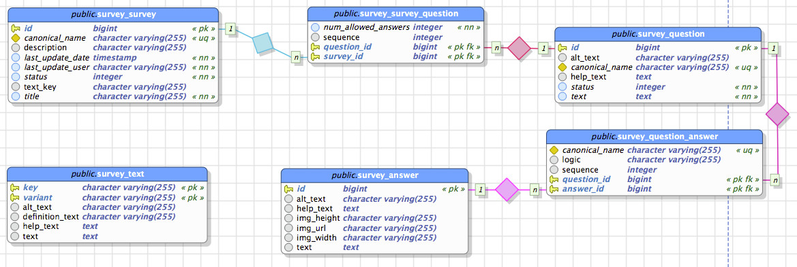

# Database Model

## Goal

Define a model to support a survey made up of multiple questions. Questions will have 2..n choices (thus supporting yes/no type questions and multiple choice).

## Design

### survey

This table defines a survey.

| Column             | Description                                             |
| ------------------ | ------------------------------------------------------- |
| `id`               | unique identifier for the survey                        |
| `canonical_name`   | unique name/key that identifies a survey. Allows external linking to the survey by a name. |
| `description`      | admin facing description of the survey (i.e. this would not be seen by the users taking the end survey) |
| `last_update_date` | timestamp of the last change saved                      |
| `last_update_user` | username of the user making the last change.            |
| `status`           | (published / unpublished). If in "published" state, we should not allow modifications to the contents of the survey. A user's answers would always be linked to a published survey. **User's entries are not part of this design. |
| `text_key`         | logical name for a group of text that is associated with this survey. :notebook: Note the key is only one half of the value used to get the text group. A "variant" determined at runtime (null is valid and default) will also determine the text for this. |
| `title`            | tile of the survey (user facing)                        |

### survey_question

This table defines the questions that are currently part of a survey

| Column                | Description                                          |
| --------------------- | ---------------------------------------------------- |
| `survey_id`           | the id of the survey - part of the primary key      |
| `question_id`         | the id of the question - part of the primary key (a question may not appear more than once on a particular survey) |
| `sequence`            | the order of the question within the set of questions for the survey. |
| `num_allowed_answers` | the number of answers the UI should allow a user to select from the provided choices. This is a "hint" for the UI and should be enforced  at the prerogative of the UI design as appropriate (i.e. for future field types, it could be ignored. For single selections, the UI may display a set of radio buttons or a dropdown list, etc). |

### question

This table defines a question that can be part of a survey. This and the svy_answer table have the same issue in completely lacking the ability to support i18n (multilingual) support.

| Column           | Description                                               |
| ---------------- | --------------------------------------------------------- |
| `id`             | the unique identifier of the question                     |
| `alt_txt`        | the tooltip display text for the question                 |
| `canonical_name` | unique name/key that identifies a question.               |
| `help_text`      | Additional help that the UI would use to display additional details / help for the user. |
| `status`         | (published / unpublished). If in "published" state, we should not allow modifications to the contents of the question. |
| `text`           | the display text for the question. |
| `type_id`        | something like this is probably needed down the line in order to support things like date fields, ranges, etc |

### question_type

this table is a reference table listing the various question types supported by the UI

| Column        | Description                         |
| ------------- | ----------------------------------- |
| `id`          | the unique identifier of the type   |
| `description` | text description of the type        |
| `alt_text`    | the tooltip description of the type |

### question_answer

This table defines the answers that are available choices for a user to select on a particular question

| Column           | Description                                               |
| ---------------- | --------------------------------------------------------- |
| `question_id`    | the id of the question - part of the primary key          |
| `answer_id`      | the id of the answer - part of the primary key (an answer may not appear in the set of answers for a particular question more than once). |
| `canonical_name` | this would be a globally-unique key (text) that would be keyed to a specific answer. Third party services, etc would be able to look for these keys in user selections in order to perform their own logic.             |
| `logic_hint`     | hint to the UI on how to end the survey once this answer is selected. Could be the id of a question to jump to if the user selects this answer (nested/ cascading question support). Could be termination text to display. Probably keyed like: TERM\|\[big block of text] or JUMP\|\[question id to jump] |
| `sequence`       | the order the answer should appear within the set of answers for the question |

### answer

This table defines a answer/option that can be part of a question. This and the svy_question table have the same issue in completely lacking the ability to support i18n (multilingual) support.

| Column       | Description                                                   |
| ------------ | ------------------------------------------------------------- |
| `id`         | the unique identifier of the answer                           |
| `alt_txt     | the tooltip display text for the answer                       |
| `help_text`  | Additional help that the UI would use to display additional details / help for the user. |
| `img_height` | image height                                                  |
| `img_url`    | URL to an image to display                                    |
| `img_width`  | image width                                                   |
| `text`       | the display text for the answer                               |

### survey_text

This table defines a grouping of text that can be used anywhere in a survey.

| Column            | Description                                              |
| ----------------- | -------------------------------------------------------- |
| `key`             | logical name for a grouping - part of the primary key    |
| `variant`         | version of the "key" grouping. The default group should have a null/empty variant - part of the primary key |
| `alt_txt`         | the tooltip display text for the answer                  |
| `definition_text` | The display text to optional use as a link to help (e.g. "Click here for more detail" might be used by the UI to link to the text supplied in the help_text field) |
| `help_text`       | Additional help that the UI would use to display additional details / help for the user. |
| `text`            | The display text                                         |

## Unresolved / Undefined Requirements

*   Should Question and/or Answer text be editable?
    *   YES: A question (or answer) could be poorly worded, have poor grammar, etc and need to be edited. Poor wording choice could be pointed out after a survey is published, thus the desire to have this editable.
    *   NO: A question or answer being re-worded could have the effect of changing the meaning entirely, rendering any previously collected data inaccurate.
*   Should we support nested / cascading questions (if I answered yes to question 1, then I see questions #2-5, otherwise skip to 6)?
    *   Maybe? This design aims for simplicity to get something working to the client and to provide a reasonable starting point for work. Simple wording choices can facilitate that the user skip questions or answer questions (like a tax form).
*   Who can edit/create a survey?
*   Where does the user's data go? Covered in: SSP-289
*   (JNW) Might we need a SpEL expression or something in svy_question to skip questions based on some conditions of the user?
*   (JNW) Define how to handle college-specific questions.  
*   May need to revisit the design if we need to support multi-lingual (i18n).
